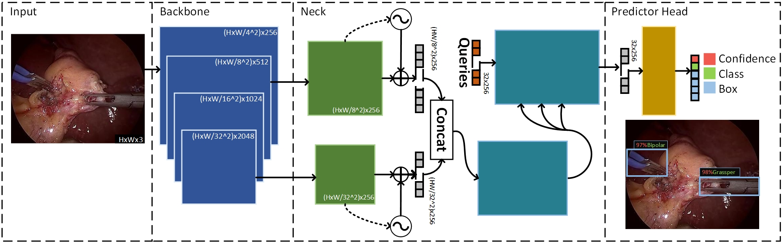

# Real-time surgical tool detection with multi-scale positional encoding and contrastive learning
PyTorch implementation for the presented model in the [paper](https://ietresearch.onlinelibrary.wiley.com/doi/full/10.1049/htl2.12060). An anchor-free architecture based on a transformer that allows realtime tool detection. It utilize multi-scale features within the backbone and the transformer-based architecture through positional encoding that can refine and capture context and structural information of different-sized tools. Furthermore, a supervised contrastive loss is introduced to optimize representations of object embeddings, resulting in improved feed-forward network performances for classifying localized bounding boxes. The strategy demonstrates superiority to state-of-the-art (SOTA) methods.  
Gerardo Loza, 
[Pietro Valdastri](https://eps.leeds.ac.uk/electronic-engineering/staff/863/professor-pietro-valdastri), 
[Sharib Ali](https://eps.leeds.ac.uk/computing/staff/11465/dr-sharib-ali)



Work done at the [STORM Lab UK](https://www.stormlabuk.com/) and the [Centre for Doctoral Training in Artificial Intelligence for Medical Diagnosis and Care](https://ai-medical.leeds.ac.uk/), University of Leeds

### Acknowledgments
This work was inspired from the paper [End-to-end object detection with Transformers](https://www.ecva.net/papers/eccv_2020/papers_ECCV/papers/123460205.pdf) and our implementation laverages the some of the code provided in the [DETR github](https://github.com/facebookresearch/detr) and the [HugginFace documentation](https://huggingface.co/docs/transformers/model_doc/detr)

# Installation
This code was tested with conda=23.1.0, python=3.9 and ubuntu 20.04.

```
git clone https://github.com/L0za007/DTx_SurgToolDetector.git
cd DTx-SurgToolDetector
conda env create --file env.yml
conda activate DTx
```

# Data
The path to the folder(s)' containing the images for each of your sets (training, validation and testing) must be specified in the config file using *root* and *\*_imgs_path* . The annotations must be in the [COCO format](https://cocodataset.org/#home), a .json file must be created for each set and copied into the *./data/datasets* directory. Alternatively, you can modify the path to the json files in the *sets_path* configuration. 
The default path is *./data/datasets* where there is a json file for each set of the **m2cai16-too-location dataset**. These files contains the annotation in the coco format, however, the images must be downladed from the link provided by the author of [m2cai16-too-location](https://ai.stanford.edu/~syyeung/tooldetection.html).

# Training 
With the processed input data, run the following command to start training.

```
python train.py -c config/Exps/DTx_MS_CL.yaml
```

This repo includes the configuration for the experiments presented in the paper but you can modify or create yours by reading the specifications of the *config/config.py* file.

# Evaluation 
Use the same configuration you used for training and excute the following command, by default, it will take the *'final.pth'* checkpoint from the Results folder and your specific experiment.

```
python eval.py -c config/Exps/DTx_MS_CL.yaml
```

# Citation

```bibtex
@article{Loza2023DTx,
   author = {Gerardo Loza and Pietro Valdastri and Sharib Ali},
   doi = {10.1049/HTL2.12060},
   issn = {2053-3713},
   journal = {Healthcare Technology Letters},
   keywords = {computer vision,medical image processing,object detection,surgery},
   publisher = {The Institution of Engineering and Technology},
   title = {Real-time surgical tool detection with multi-scale positional encoding and contrastive learning},
   url = {https://onlinelibrary.wiley.com/doi/full/10.1049/htl2.12060 https://onlinelibrary.wiley.com/doi/abs/10.1049/htl2.12060 https://ietresearch.onlinelibrary.wiley.com/doi/10.1049/htl2.12060},
   year = {2023},
}
```

